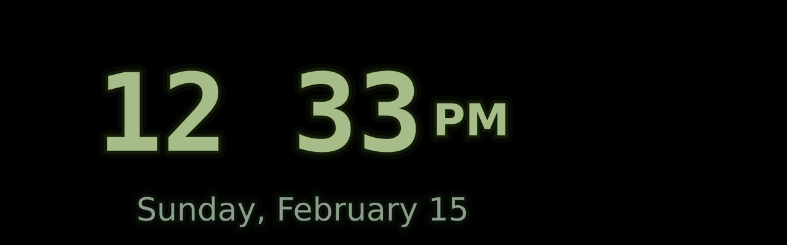

# Screensaver Feature

## Overview

The screensaver activates after 5 minutes of idle time (no playback and no user interaction). It randomly selects between two clock modes each time it activates: a floating neon digital clock or a glow-in-the-dark analog clock. Both modes share rainbow hue cycling and a breathing intensity animation. Any mouse click, key press, or music playback immediately deactivates it.



## Clock Modes

### Digital

A floating clock displaying time (12-hour with blinking colon), AM/PM, and the current date. The text block bounces off the screen edges like a DVD screensaver to prevent burn-in.

Rendered using 3-layer neon glow via QPainterPath strokes:
1. Outer glow — wide pen, low alpha
2. Mid glow — medium pen, medium alpha
3. Core — narrow filled path, white-tinted color

Fonts: DejaVu Sans Mono for time (44px * UI_SCALE), DejaVu Sans for AM/PM (18px) and date (13px).

### Analog

A watch face that fills the full rectangular display (1280x400 at UI_SCALE=4). Uses a ray-to-edge algorithm to project clock positions from the center onto the rectangle perimeter, so tick marks line the edges rather than forming a circle.

**Elements:**
- **60 tick marks** at the rectangle edges: 4 major ticks at 12/3/6/9 (6px long, 2.5px wide), 8 minor hour ticks (3.5px, 1.5px), 48 minute ticks (1.5px, 0.75px). All dimensions multiplied by UI_SCALE.
- **Hour hand** — extends 45% from center toward edge, 3px * UI_SCALE thick
- **Minute hand** — extends 70% toward edge, 2px * UI_SCALE thick
- **Second marker** — a small red rectangle on the perimeter that sweeps smoothly (using milliseconds). Always oriented toward the center.
- **Center dot** — glowing circle at hand pivot

**Glow-in-the-dark rendering:** Elements are painted to a 1/4-size offscreen buffer (320x100), blurred with a 3-pass box blur approximating Gaussian, then composited as a soft glow layer underneath the sharp full-resolution core. This produces a natural phosphorescent bloom where thicker elements glow more intensely than thin ones.

## Shared Effects

- **Rainbow hue cycling**: Full 360-degree cycle in ~60 seconds (0.2 degrees per frame at 30fps)
- **Breathing**: Sinusoidal intensity modulation with ~3.5 second period, ranging 0.75-1.0

## Architecture

### Files

```
src/view-screensaver/
  screensaverview.h     # Class definition with ClockMode enum
  screensaverview.cpp   # All rendering logic
  screensaverview.ui    # Qt Designer UI (minimal)

src/view-basewindow/
  mainwindow.h          # SCREENSAVER_TIMEOUT_MS, timer management
  mainwindow.cpp        # activateScreenSaver(), deactivateScreenSaver()
```

### Activation Flow

1. `MainWindow` monitors all audio sources' `playbackStateChanged` signals
2. When playback stops/pauses, a single-shot `QTimer` starts (5 minute countdown)
3. On timeout, `activateScreenSaver()` calls `screenSaver->start()` (randomizes mode, resets hue) then switches the view stack to index 3
4. Any user input emits `userActivityDetected()`, which triggers `deactivateScreenSaver()` — returns to player view and resets the timer

### Performance Optimizations (Analog Mode)

The analog clock is optimized for Raspberry Pi 4:

- **Zero per-frame heap allocations**: Glow buffers (`m_glowBuffer`, `m_glowTmp`) are pre-allocated as members and reused every frame
- **Precomputed tick geometry**: 60 tick line segments computed once on size change, stored as `QLineF` arrays batched by weight class (major/minor/minute)
- **Batched drawing**: 3 `drawLines()` calls replace 60 individual `drawLine()` calls
- **No full-res intermediate buffer**: Elements painted twice — once to 1/4-size glow buffer (with QPainter scale transform, no antialiasing), once directly to screen (with AA)
- **Single blur layer**: Radius 3, 2 passes (4 sub-passes total) on a 320x100 image
- **Raw pointer blur**: `bits()`/`constBits()` called once per blur function, stride arithmetic for pixel access

## Configuration

```cpp
// mainwindow.h — screensaver idle timeout
#define SCREENSAVER_TIMEOUT_MS (5 * 60 * 1000)
```

## Testing

1. Build: `make`
2. Run: `./start.sh`
3. Wait for idle timeout (or temporarily reduce `SCREENSAVER_TIMEOUT_MS` to 10 seconds for testing)
4. Dismiss (click or keypress), wait again — may get the other mode
5. **Digital**: floating neon clock bouncing off edges, rainbow cycling
6. **Analog**: tick marks at rectangle edges, hands from center, red sweeping second marker, phosphorescent glow bloom, rainbow cycling
