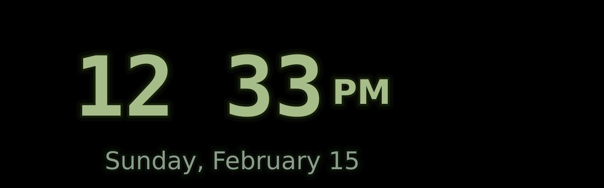

# Screensaver Feature

## Overview

The screensaver activates after 5 minutes of idle time (no playback and no user interaction). It randomly selects one of 15 themed clock faces each time it activates: 10 analog dials and 5 digital styles. All faces float and bounce around the screen to prevent burn-in. Any mouse click, key press, or music playback immediately deactivates it.



## Clock Themes

### Analog Themes

All analog themes render a circular watch dial that bounces around the screen. Each theme defines its own hand shapes, tick markers, colors, and decorative elements via the `ClockTheme` struct in `clockthemes.h`.

| Theme | Dial | Hands | Ticks | Accents |
|-------|------|-------|-------|---------|
| **Luxury** | Deep blue | Gold tapered hour, gold sword minute | Triangle cardinals, rect hours, line minutes | Green lume dots, gold rim, 1 decorative ring |
| **Aviator** | Dark charcoal | White sword hour+minute, orange needle second | Rect at all hours, line minutes | Arabic numerals at 12/3/6/9, orange accents |
| **Diver** | Black | Mercedes hour, sword minute, needle second w/ counterweight | Triangle at 12/3/6/9, luminous dots at hours | Green lume dots, 2 decorative rings |
| **Minimalist** | Pure black | Thin needle for all 3 hands | Small dots at hours only, no minute ticks | Muted colors, subtle breathing, minimal rim |
| **Chronograph** | Dark gray | Dauphine hour+minute, needle second w/ counterweight | Rect indices, line minutes | 3 decorative rings, tachymeter outer ring, yellow second hand |
| **Neon Retro** | Transparent dark | Alpha/leaf outlines (no fill), needle second | Diamond cardinals+hours, dot minutes | Hue-cycling colors, outline-only rendering, 1.5x glow, Arabic numerals |
| **Bauhaus** | Matte black | Hairline white baton hour+minute, yellow needle second | White hour bars, dotted minute ring | Chrome-yellow second hand with pivot dot, Dieter Rams restraint |
| **Mondaine** | Signage white | Bold black baton hour+minute | Bold black hour bars, thin minute lines | Iconic red disc-tipped ("lollipop") second hand, Swiss-railway look |
| **Orbital** | Dark blue-black | None — hands-free | Faint concentric guide rings | Glowing hour/minute/second arc trails sweeping clockwise from 12, center digital readout |
| **Guilloché** | Emerald radial gradient | Gold dauphine hour+minute, gold needle second | Gold applied rect indices | Radial sunburst dial texture, gold rim and center |

**Hand shapes** (`HandShape` enum): Tapered, Sword, Mercedes (circle cutout), Dauphine (diamond cross-section), Needle, Breguet (moon-hole), Alpha/Leaf (sinusoidal bulge), Baton (flat rectangle).

**Tick shapes** (`TickShape` enum): Line, Rect, Triangle, Dot, Diamond.

**Special analog renders:** the **Orbital** face (`orbital` flag) skips the hand/tick pipeline and draws three glowing arc trails plus a center digital readout; the **Guilloché** face (`guilloche` flag) fills the dial with a radial gradient and 180 sunburst lines clipped to the dial. The disc-tipped second hand (Mondaine/Bauhaus) is driven by the `secondDisc`/`secondDiscDist`/`secondDiscRadius` fields in `HandConfig`.

**Glow-in-the-dark rendering:** Elements are painted to a glow buffer sized to the dial bounding box at 1/4 resolution, blurred with a 2-pass box blur approximating Gaussian, then composited as a soft glow layer underneath the sharp full-resolution core. Glow intensity is configurable per theme (e.g., Neon gets 1.5x, Minimalist gets 0.3x).

### Digital Themes

Digital faces all bounce off the screen edges like a DVD screensaver. The style is selected per theme via the `DigitalStyle` enum (`Neon`, `SevenSegment`, `SplitFlap`, `Nixie`, `Terminal`); `paintDigitalClock()` dispatches to the matching renderer, and the shared `placeFloatingBlock()` helper handles centering and edge bouncing for a content block of any size.

| Style | Look |
|-------|------|
| **Neon** | Floating time (12-hour, blinking colon), AM/PM and date with a 3-layer neon glow and rainbow hue cycling |
| **Seven Segment** | Cyan lit segments over dim ghost segments with soft bloom, glowing colon, AM/PM + seconds label |
| **Split Flap** | Charcoal Solari flip tiles with a center seam, axle notches and condensed white numerals (HOURS / MINUTES / SECONDS) |
| **Nixie** | Four glass tubes with warm orange glow cathodes, faint caged "8" ghost digits, end caps and neon colon dots |
| **Terminal** | Phosphor-green CRT console panel — prompt, large time, date and a blinking cursor block over scanlines |

The original Neon style renders with 3-layer glow via QPainterPath strokes (outer wide/low-alpha, mid medium, core narrow white-tinted fill). Fonts: DejaVu Sans Mono for time (44px * UI_SCALE), DejaVu Sans for AM/PM (18px) and date (13px).

## Shared Effects

- **Rainbow hue cycling**: Full 360-degree cycle in ~60 seconds (0.2 degrees per frame at 30fps). Only applied to Neon Retro theme for analog; always active for digital.
- **Breathing**: Sinusoidal intensity modulation, amount configurable per theme (0.1–0.3)
- **Bouncing**: All clock modes bounce off screen edges to prevent OLED/LCD burn-in

## Architecture

### Files

```
src/view-screensaver/
  clockthemes.h       # Theme data structures, hand polygon generators, 15 theme definitions
  screensaverview.h   # Class definition with ClockMode enum, themed drawing methods
  screensaverview.cpp # All rendering logic (digital + themed analog)
  screensaverview.ui  # Qt Designer UI (minimal)

src/view-basewindow/
  mainwindow.h        # SCREENSAVER_TIMEOUT_MS, timer management
  mainwindow.cpp      # activateScreenSaver(), deactivateScreenSaver()
```

### Theme System

`ClockTheme` (in `clockthemes.h`) is a header-only struct containing:
- `ClockColors` — all colors (dial, hands, ticks, numerals, lume, center pin, rim, decorative rings)
- `HandConfig` — shape, length, width for each hand + counterweight options
- `TickConfig` — shape and size for cardinal/hour/minute ticks + luminous dots toggle
- Rendering flags: `isDigital`, `digitalStyle`, `orbital`, `guilloche`, `outlineOnly`, `hueCycling`, `glowIntensity`, `breatheAmount`
- Dial properties: `dialRadiusFraction`, `decorativeRings`, `tachymeterRing`, `numeralStyle`

Hand polygons are generated by shape-specific functions returning `QVector<QPointF>` in local coordinates (pivot at origin, tip pointing up). The caller rotates and translates to the dial center.

### Activation Flow

1. `MainWindow` monitors all audio sources' `playbackStateChanged` signals
2. When playback stops/pauses, a single-shot `QTimer` starts (5 minute countdown)
3. On timeout, `activateScreenSaver()` calls `screenSaver->start()` (selects random theme, sets clock mode, resets hue) then switches the view stack to index 3
4. Any user input emits `userActivityDetected()`, which triggers `deactivateScreenSaver()` — returns to player view and resets the timer

### Performance

The analog clock is optimized for Raspberry Pi 4:

- **Dial-sized glow buffer**: Glow buffer is sized to the dial bounding box (not full screen), reducing blur work
- **Zero per-frame heap allocations**: Glow buffers pre-allocated as members, reused every frame
- **No full-res intermediate buffer**: Elements painted twice — once to 1/4-size glow buffer (no AA), once directly to screen (with AA)
- **Single blur layer**: Radius 3, 2 passes on the small glow buffer
- **Raw pointer blur**: `bits()`/`constBits()` called once per blur function, stride arithmetic for pixel access

## Configuration

```cpp
// mainwindow.h — screensaver idle timeout
#define SCREENSAVER_TIMEOUT_MS (5 * 60 * 1000)
```

## Testing

1. Build: `make`
2. Run: `./start.sh`
3. Wait for idle timeout (or temporarily reduce `SCREENSAVER_TIMEOUT_MS` for testing)
4. Dismiss (click or keypress), wait again — will get a different random theme
5. 15 possible themes — analog: Luxury, Aviator, Diver, Minimalist, Chronograph, Neon Retro, Bauhaus, Mondaine, Orbital, Guilloché; digital: Neon, Seven Segment, Split Flap, Nixie, Terminal
