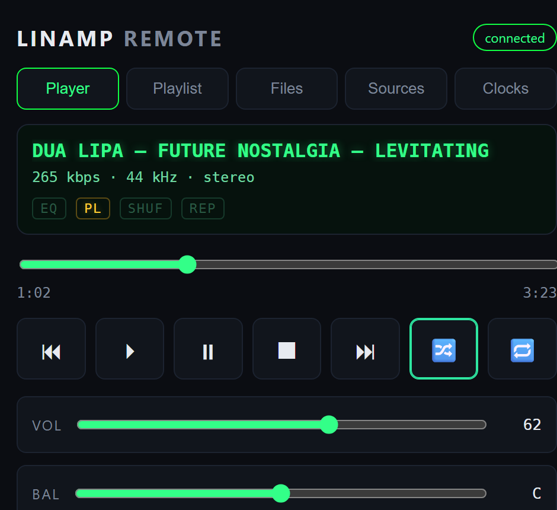
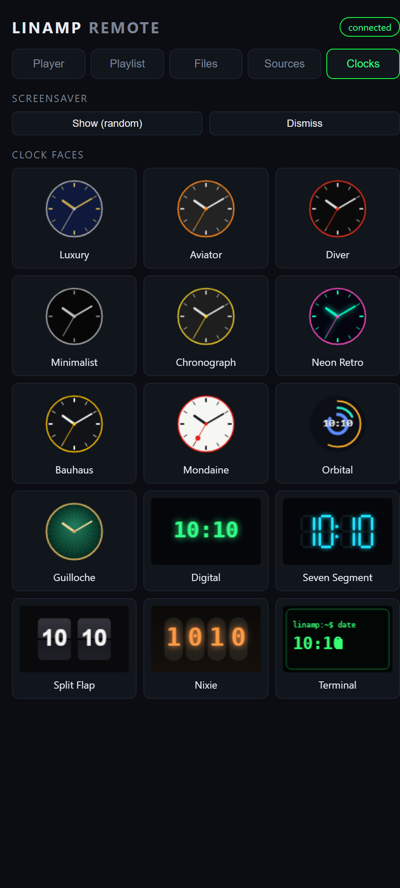

# Web Remote Interface

Linamp serves its own responsive web interface directly from the device, so you
can control everything from a phone or desktop browser on the same LAN — no app
to install. The page is **embedded in the player binary** (via a Qt resource),
so there is no separate web server, build toolchain, or files to deploy.

Open `http://<linamp-ip>:8080/` (default port; configurable — see
[API.md](API.md)).



## Tabs

- **Player** — now-playing (artist/title), bitrate / sample-rate / mono-stereo,
  EQ/PL/shuffle/repeat indicators, a seek bar bound to position/duration,
  transport buttons, and volume / balance sliders. All state updates live.
- **Playlist** — the current queue with title / artist / duration; tap a row to
  play it, ✕ to remove, Clear to empty. The current track is highlighted.
- **Files** — browse the device's music folder and add tracks. Strictly
  sandboxed to a configurable root (`api/musicRoot`, default `~/Music`).
- **Sources** — switch the active audio source (File / Bluetooth / CD / Spotify)
  and toggle VBAN streaming.
- **Clocks** — trigger / dismiss the screensaver and pick a specific clock face
  from a gallery. Each face is shown as a small live **thumbnail** rendered in
  the browser (canvas), so the picker costs the device nothing.



## Architecture

```
 AudioSource / Coordinator / SystemAudio  (existing Qt signals)
        ▼
   WebStateHub   — aggregates the live snapshot, emits stateChanged/positionChanged
        ▼
   SseBroker     — fans state out to connected browsers as Server-Sent Events
        ▲
   ApiServer     — routes /api/*, serves the embedded page from webui.qrc,
                   hands /api/events sockets to the broker
        ▲
   Browser       — EventSource('/api/events') for live state; GET /api/* for control
```

- **Live updates** use **Server-Sent Events** (`text/event-stream`) over the
  existing `QTcpServer` — no extra dependency, no WebSocket. The browser's
  `EventSource` auto-reconnects. Controls are plain `GET` requests.
- All request handlers run on the Qt GUI event loop (single-threaded), so they
  call the player's slots directly.
- The frontend is vanilla HTML/CSS/JS in `webui/` (`index.html`, `app.css`,
  `app.js`, `api.js`), compiled into the binary through `webui.qrc`.

Backend source lives in `src/api/`:
`apiserver.{h,cpp}` (HTTP + routing + static serving), `webstatehub.{h,cpp}`
(state aggregation), `ssebroker.{h,cpp}` (SSE fan-out).

## Configuration

Web-interface settings share the `[api]` group in
`~/.config/Rod/Linamp.conf` (see [API.md](API.md) for the full table):

| Key | Default | Meaning |
|---|---|---|
| `enabled` | `true` | Serve the API + web UI |
| `port` | `8080` | TCP port |
| `bindAddress` | `0.0.0.0` | Interface to bind |
| `token` | (empty) | If set, the page prompts for it and forwards it on every request |
| `musicRoot` | `~/Music` (else `~`) | Sandbox root for the Files tab |
| `maxSseClients` | `8` | Cap on simultaneous live-update connections |

## Security notes

- **LAN-bound by default, no auth.** Set a `token` to require it on every
  request (the page sends it via `?token=` / `Authorization: Bearer`).
- **The file browser is sandboxed** to `musicRoot`: paths are canonicalized and
  rejected unless they stay under the root — `..` traversal, absolute paths and
  symlinks escaping the root all return `400`.
- Responses send `Access-Control-Allow-Origin: *`. On an untrusted network,
  prefer a token and/or a reverse proxy. HTTPS is out of scope (LAN-only).

## Notes

- The browser UI intentionally has **no audio spectrum** — a remote shouldn't
  make the device run an FFT for every viewer. The on-device analyzer is
  unaffected.
- The interface is built in phases; design specs and plans live under
  `docs/superpowers/specs/` and `docs/superpowers/plans/`.
