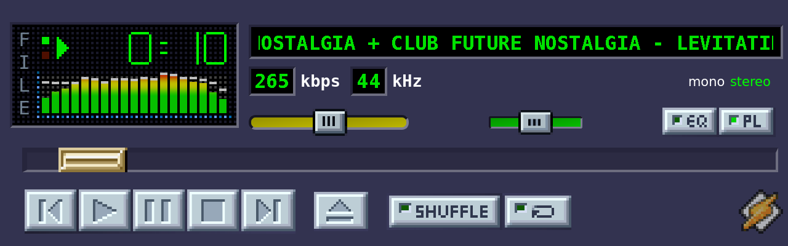
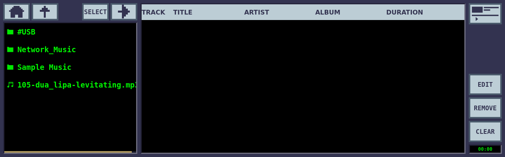
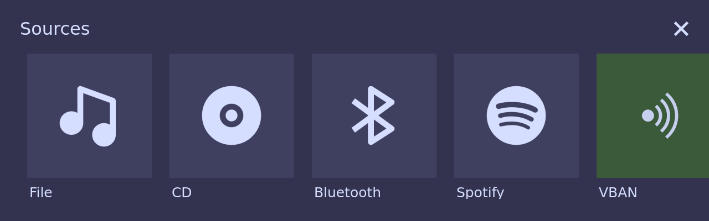

# UI & View System

| | |
|---|---|
|  |  |
| Player view | Playlist view |
|  |  |
| Source selection menu | Screensaver |

## Window Hierarchy

```
QApplication
  └── MainWindow (QMainWindow)
        └── QStackedLayout (viewStack)
              ├── Index 0: BaseWindow > DesktopPlayerWindow > PlayerView + ControlButtons
              ├── Index 1: BaseWindow > PlaylistView
              ├── Index 2: MainMenuView
              ├── Index 3: ScreenSaverView
              └── Index 4: AvsView
```

The `BaseWindow` wrapper is conditionally compiled:
- `IS_EMBEDDED` defined: `EmbeddedBaseWindow` (fullscreen, no title bar)
- `IS_EMBEDDED` not defined: `DesktopBaseWindow` (windowed, draggable title bar)

Window dimensions (before scaling):
- Embedded: 320 x 100 px (1280 x 400 at 4x scale)
- Desktop: 277 x 117 px (1108 x 468 at 4x scale)

## Desktop vs Embedded Variants

### DesktopBaseWindow

**Files:** `src/view-basewindow/desktopbasewindow.h`, `.cpp`, `.ui`

Windowed mode with a custom TitleBar:
```
DesktopBaseWindow
  └── outerFrame (3D beveled border)
        ├── TitleBar (draggable, minimize/close buttons)
        └── bodyOuterFrame > bodyInnerFrame > body (content area)
```

The beveled border uses the classic Winamp look:
- Outer frame: light top/left (`#5c5c63`), dark bottom/right (`#25253a`)
- Inner frames: inverted for 3D depth effect
- Base color: `#333350` (purple-gray)

TitleBar (`src/view-basewindow/titlebar.h`, `.cpp`) implements window dragging via `mousePressEvent`/`mouseMoveEvent` and has minimize/close buttons.

### EmbeddedBaseWindow

**Files:** `src/view-basewindow/embeddedbasewindow.h`, `.cpp`, `.ui`

Minimal wrapper -- just `ui->setupUi(this)`. No title bar, no beveled borders. The `body` widget fills the entire window. Designed for fullscreen on Raspberry Pi.

## PlayerView

**Files:** `src/view-player/playerview.h`, `.cpp`, `.ui`

The main playback interface showing spectrum visualizer, track info, transport controls, and sliders.

### Layout

```
PlayerView (background #333350)
  └── verticalLayout
      ├── topStatusContainer (HBox)
      │   ├── visualizationContainer
      │   │   └── visualizationFrame (93x43px unscaled)
      │   │       ├── SpectrumWidget
      │   │       └── progressTimeLabel (green #00f800, "bignumbers" font)
      │   └── infoContainer
      │       ├── songInfoLabel (ScrollText widget, marquee)
      │       ├── inputLabel (source label: "F\nI\nL\nE")
      │       └── codecDetailsContainer
      │           ├── kbpsFrame (bitrate display)
      │           └── khzFrame (sample rate, mono/stereo indicator)
      ├── posBar (QSlider, position/seek)
      ├── horizontalWidget_2
      │   ├── volumeSlider (LinampSlider, green→yellow→red gradient)
      │   ├── balanceSlider (LinampSlider, center-green gradient)
      │   ├── eqButton (toggle)
      │   └── playlistButton (toggle)
      └── (ControlButtonsWidget provided externally)
```

### Public Slots

| Slot | Description |
|---|---|
| `setPlaybackState(PlaybackState)` | Update play/pause/stop icon |
| `setPosition(qint64)` | Update position slider and time display |
| `setSpectrumData(QByteArray, QAudioFormat)` | FFT data for visualizer |
| `setMetadata(QMediaMetaData)` | Update track info, bitrate, sample rate |
| `setDuration(qint64)` | Set slider maximum |
| `setVolume(int)` | Update volume slider (0-100) |
| `setBalance(int)` | Update balance slider (-100 to 100) |
| `setEqEnabled(bool)` | EQ button state |
| `setPlEnabled(bool)` | Playlist button state |
| `setShuffleEnabled(bool)` | Shuffle button state |
| `setRepeatEnabled(bool)` | Repeat button state |
| `setMessage(QString, qint64)` | Show temporary message (replaces track info) |
| `clearMessage()` | Restore track info display |
| `setSourceLabel(QString)` | Display source label vertically (e.g., "F\nI\nL\nE") |

### Signals

| Signal | Description |
|---|---|
| `volumeChanged(int)` | Volume slider moved (0-100) |
| `balanceChanged(int)` | Balance slider moved (-100 to 100, snaps to center at +/-20) |
| `positionChanged(qint64)` | Seek position |
| `playClicked()`, `pauseClicked()`, `stopClicked()` | Transport buttons |
| `nextClicked()`, `previousClicked()` | Track navigation |
| `openClicked()` | Open/eject button |
| `eqClicked()`, `plClicked()` | EQ/Playlist toggles |
| `shuffleClicked()`, `repeatClicked()` | Mode toggles |
| `menuClicked()` | Logo button clicked |

## PlaylistView

**Files:** `src/view-playlist/playlistview.h`, `.cpp`, `.ui`

Dual-panel interface: playlist on the left, file browser on the right.

### Layout

```
PlaylistView
  ├── goPlayerButton (return to player)
  └── Dual Panel (HBox)
      ├── Left: Playlist
      │   ├── playList (QTreeView)
      │   │   Columns: Icon, Title, Artist, Album, Duration
      │   ├── controlButtons (Edit, Clear, Remove)
      │   └── plDuration (total duration label)
      └── Right: File Browser
          ├── fbUpButton, fbHomeButton (navigation)
          ├── fileBrowserListView (QListView + QFileSystemModel)
          └── fbSelectButton, fbAddButton
```

### Touch Scrolling

Both panels use `QScroller` configured for touch input:
- `DragVelocitySmoothingFactor: 0.6`
- `MaximumVelocity: 0.5`
- `OvershootDragResistanceFactor: 0.3`
- Grabbed as `LeftMouseButtonGesture`

Touch scrolling is disabled during edit mode (drag-and-drop reordering).

### File Browser

- Starts at `QStandardPaths::MusicLocation`
- Filters to audio files and directories only (via `audioFileFilters()` from `util.h`)
- Custom icons via `FileBrowserIconProvider`: folder and music note icons with selected variants
- Single tap on directory enters it, tap on file selects it
- "Add" button sends selected files to `AudioSourceFile::addToPlaylist()`

### Custom QMediaPlaylist

**Files:** `src/view-playlist/qmediaplaylist.h`, `.cpp`, `qmediaplaylist_p.h`, `.cpp`

Qt 6 removed `QMediaPlaylist`, so Linamp includes a custom reimplementation with:

- **Playback modes:** `CurrentItemOnce`, `CurrentItemInLoop`, `Sequential`, `Loop`
- **Shuffle:** Randomizes order, `unshuffle()` restores original order
- **Metadata caching:** Uses `QMap<QUrl, QMediaMetaData>` to avoid re-reading tags
- **Drag-and-drop:** `PlaylistModel` supports reordering via MIME type `"application/playlist.model"`

### PlaylistModel

**File:** `src/view-playlist/playlistmodel.h`, `.cpp`

`QAbstractItemModel` wrapper around `QMediaPlaylist`:

```cpp
enum Column { Track = 0, Title, Artist, Album, Duration, ColumnCount };
```

Supports drag-and-drop reordering with `mimeData()`/`dropMimeData()`.

### Signals

| Signal | Description |
|---|---|
| `showPlayerClicked()` | Return to player view |
| `songSelected(QModelIndex)` | Track double-clicked for playback |
| `addSelectedFilesClicked(QList<QUrl>)` | Add files from browser to playlist |

## MainMenuView

**Files:** `src/view-menu/mainmenuview.h`, `.cpp`, `.ui`

Source selection screen with buttons for each audio source.

### Layout

```
MainMenuView (background #333350)
  ├── Header: "Sources" label + close button
  └── Content: Source buttons
      ├── fileSourceButton (File/Local Music) → sourceSelected(0)
      ├── btSourceButton (Bluetooth) → sourceSelected(1)
      ├── spotifySourceButton (Spotify) → sourceSelected(2)
      ├── cdSourceButton (CD Audio) → sourceSelected(3)
      └── [Shutdown option]
```

### Signals

| Signal | Description |
|---|---|
| `sourceSelected(int)` | Source index selected |
| `backClicked()` | Return to player view |
| `shutdownClicked()` | Trigger system shutdown |

## ScreenSaverView

**Files:** `src/view-screensaver/screensaverview.h`, `.cpp`, `.ui`, `clockthemes.h`

Clock screensaver with 7 themed clock faces (6 analog watch styles + neon digital), randomly selected on each activation. See [SCREENSAVER.md](SCREENSAVER.md) for full details.

### Themes

6 analog themes (Luxury, Aviator, Diver, Minimalist, Chronograph, Neon Retro) each define hand shapes, tick markers, colors, and decorative elements via `ClockTheme` in `clockthemes.h`. The analog dial is circular and bounces around the screen. A 7th theme renders the neon digital clock (floating time/date text).

Glow rendering uses an offscreen buffer sized to the dial bounding box at 1/4 resolution, blurred and composited as a soft bloom under sharp core elements.

### Timeout Configuration

```cpp
#define SCREENSAVER_TIMEOUT_MS (5 * 60 * 1000)  // mainwindow.h
```

### Activation

- Music must not be playing (StoppedState or PausedState)
- No user interaction for `SCREENSAVER_TIMEOUT_MS`
- `MainWindow::activateScreenSaver()` calls `screenSaver->start()` to select random theme

### Signal

| Signal | Description |
|---|---|
| `userActivityDetected()` | Mouse click or key press detected |

## Scaling System

**Files:** `src/shared/scale.h`, `scale.cpp`

### Constants

```cpp
#define UI_SCALE 4       // Currently hardcoded to 4x
#define IS_EMBEDDED       // Enables embedded/fullscreen mode
```

### Stylesheet Loading

```cpp
QString getStylesheet(QString name) {
    // Loads ":/styles/{name}.{UI_SCALE}x.qss"
    QFile file(":/styles/" + name + "." + QString::number(UI_SCALE) + "x.qss");
    file.open(QFile::ReadOnly);
    return QLatin1String(file.readAll());
}
```

Each UI component that needs scale-dependent styling loads its stylesheet at construction:
```cpp
ui->volumeSlider->setStyleSheet(getStylesheet("playerview.volumeSlider"));
// Loads: ":/styles/playerview.volumeSlider.4x.qss"
```

### Scaling Pattern in Widgets

Most widgets implement a private `scale()` method:
```cpp
void PlayerView::scale() {
    // Multiply sizes by UI_SCALE
    ui->widget->setMaximumSize(ui->widget->maximumSize() * UI_SCALE);
    // Scale layout margins
    auto m = layout->contentsMargins();
    layout->setContentsMargins(m * UI_SCALE);
    // Load scale-dependent stylesheet
    ui->posBar->setStyleSheet(getStylesheet("playerview.posBar"));
}
```

### Stylesheet Files

All in `styles/`, with 4 scale variants each (1x, 2x, 3x, 4x):

| Component | Description |
|---|---|
| `desktopbasewindow` | Base window styling |
| `controlbuttonswidget.repeatButton` | Repeat toggle button |
| `controlbuttonswidget.shuffleButton` | Shuffle toggle button |
| `playerview.posBar` | Position/seek slider |
| `playerview.volumeSlider` | Volume slider |
| `playerview.balanceSlider` | Balance slider |
| `playerview.eqButton` | EQ toggle |
| `playerview.playlistButton` | Playlist toggle |
| `playerview.kbpsFrame` | Bitrate frame |
| `playerview.khzFrame` | Sample rate frame |
| `playerview.visualizationFrame` | Spectrum analyzer frame |
| `playerview.songInfoContainer` | Track info container |
| `playerview.codecDetailsContainer` | Codec details container |

## Custom Widgets

### SpectrumWidget

**Files:** `src/view-player/spectrumwidget.h`, `.cpp`

19-band FFT spectrum analyzer with peak hold.

**Constants:**
| Constant | Value |
|---|---|
| `DFT_SIZE` | 512 (FFT input samples) |
| `N_BANDS` | 19 |
| `VIS_DELAY` | 1 frame before falloff |
| `VIS_FALLOFF` | 4 px/frame bar decay |
| `VIS_PEAK_DELAY` | 16 frames peak hold |
| `VIS_PEAK_FALLOFF` | 1 px/frame peak decay |

**Rendering pipeline (30 fps via 33ms timer):**
1. `paintBackground()` -- grid of 1px dots
2. `paintSpectrum()` -- 19 bars (3px wide, 1px gap) with 16-color gradient (red→orange→yellow→green)
3. `paintPeaks()` -- peak markers above bars

**Data flow:**
1. Receives Int16 stereo PCM via `setData(QByteArray, QAudioFormat)`
2. Converts to float, averages stereo channels
3. Applies FFT via `calc_freq()` (from `src/shared/fft.h`, based on Audacious project)
4. Maps 256 frequency bins to 19 logarithmic bands
5. Applies 40 dB dynamic range, smooth falloff

### ScrollText

**Files:** `src/view-player/scrolltext.h`, `.cpp`

Marquee-scrolling text widget for long track names.

- If text fits widget width: displays left-aligned, no scrolling
- If text exceeds width: scrolls continuously with separator `" --- "`
- Animation: 50ms timer, 2px per frame (20 Hz)
- Uses `QStaticText` for optimized rendering

### LinampSlider

**Files:** `src/shared/linampslider.h`, `.cpp`

Custom QSlider with gradient background.

```cpp
void setGradient(QColor from, QColor to, Qt::Orientation);
void setGradient(QList<QColor> steps, Qt::Orientation);
```

Generates a gradient `QImage` and applies it as the slider background via stylesheet. Updates on value change.

Used for:
- **Volume slider:** 16-stop gradient green→yellow→red
- **Balance slider:** 32-stop gradient with green at center, red at extremes

### ControlButtonsWidget

**Files:** `src/view-player/controlbuttonswidget.h`, `.cpp`, `.ui`

Transport controls:
```
[Logo] [<<] [>] [||] [■] [>>] [Open] [Repeat] [Shuffle]
```

Signals: `playClicked()`, `pauseClicked()`, `stopClicked()`, `nextClicked()`, `previousClicked()`, `openClicked()`, `repeatClicked(bool)`, `shuffleClicked(bool)`, `logoClicked()`

## SystemAudioControl

**Files:** `src/shared/systemaudiocontrol.h`, `.cpp`

Direct ALSA mixer control for the "Master" volume element.

### Methods

| Method | Description |
|---|---|
| `setVolume(int)` | Set volume 0-100, applies to ALSA |
| `setBalance(int)` | Set balance -100 to 100, splits left/right channels |
| `getVolume()` | Read current volume |
| `getBalance()` | Read current balance |

### Balance Calculation

```cpp
long leftVolume = (balance <= 0) ? targetVolume
                                 : targetVolume - (balance * targetVolume) / 100;
long rightVolume = (balance >= 0) ? targetVolume
                                  : targetVolume + (balance * targetVolume) / 100;
```

### Polling

A 10-second timer polls ALSA for external volume changes (e.g., from `alsamixer` or another application). Emits `volumeChanged(int)` or `balanceChanged(int)` if values differ.

## Qt Resource System

**File:** `uiassets.qrc`

All UI assets are embedded into the executable via Qt's resource system. Access pattern:

```cpp
QPixmap image;
image.load(":/assets/status_playing.png");
```

### Asset Categories

| Category | Examples |
|---|---|
| Transport controls | `play.png`, `pause.png`, `stop.png`, `next.png`, `prev.png`, `open.png` (+ `_p.png` pressed variants) |
| Status indicators | `status_playing.png`, `status_paused.png`, `status_stopped.png` |
| Slider handles | `posHandle.png`, `volumeHandle.png`, `balanceHandle.png`, `scroll_handle.png` (+ pressed) |
| Toggle buttons | `eq_on/off.png`, `pl_on/off.png`, `repeat_on/off.png`, `shuffle_on/off.png` |
| Playlist UI | `pl_add.png`, `pl_close.png`, navigation icons |
| File browser | `fb_folderIcon.png`, `fb_musicIcon.png` (+ selected variants) |
| Source icons | `source-icon-file.png`, `source-icon-bluetooth.png`, `source-icon-cd.png`, `source-icon-spotify.png` |
| Window chrome | `windowClose.png`, `windowMinimize.png`, `logoButton.png` |
| Fonts | `bignumbers.ttf` (digital time display) |
| Stylesheets | 52 `.qss` files (13 components x 4 scale variants) |

### Adding New Assets

1. Add the file to the `assets/` or `styles/` directory
2. Add a `<file>` entry to `uiassets.qrc`
3. Access via `":/assets/yourfile.png"` or `":/styles/yourfile.qss"` in code
4. Rebuild (CMake handles `AUTORCC`)
